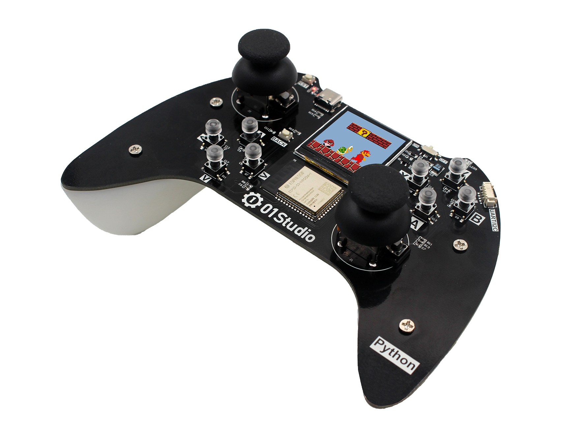
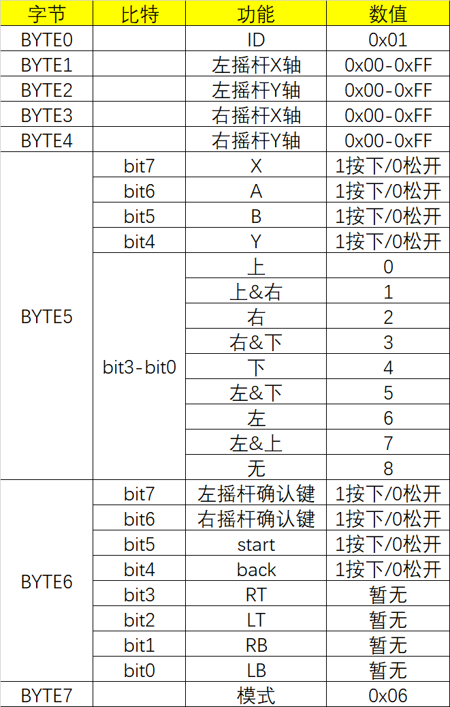

.. _pyController_quickref:

pyController用户手册
=============================

硬件资源
---------

教程资料
-----------------
pyController是基于MicroPython实现，01Studio提供完整的入门教程和代码相关资料:

https://download.01studio.cc/

手柄数据
------------

.. class:: controller.CONTROLLER(None)

    构建手柄对象。
	
示例::

    import controller
	
    gamepad = controller.CONTROLLER()  #构建手柄对象

.. method:: CONTROLLER.read()

	读取手柄和摇杆数据。返回8字节元组，代表手柄按键和摇杆的所有数据。
    
	例：(1,135,131,125,132,8,0,6)
	
	协议明细见下图：

  pyController手柄数据协议

NES游戏
------------

.. class:: game.NES(None)

    构建手柄对象。NES对象已经整合手柄按键和摇杆数据，无需额外初始化手柄。
	
示例::

    import game
	
    nes = game.NES()  #构建NES对象

.. method:: NES.start(file)

	启动nes游戏模拟器。启动成功后进入阻塞，无法运行其它代码。
	
	- ``file`` 路径+名称，如："/mario.nes"表示flash根目录下的mario.nes文件。

1.54寸LCD屏
------------ 
使用方法参考：https://docs.01studio.cc/library/tftlcd/tftlcd.LCD15.html 

WiFi连接
----------

The :mod:`network` module::

    import network

    wlan = network.WLAN(network.STA_IF) # 创建 station 接口
    wlan.active(True)       # 激活接口
    wlan.scan()             # 扫描允许访问的SSID
    wlan.isconnected()      # 检查创建的station是否连已经接到AP
    wlan.connect('essid', 'password') # 连接到指定ESSID网络
    wlan.config('mac')      # 获取接口的MAC地址
    wlan.ifconfig()         # 获取接口的 IP/netmask(子网掩码)/gw(网关)/DNS 地址

    ap = network.WLAN(network.AP_IF) # 创捷一个AP热点接口
    ap.config(essid='ESP-AP') # 激活接口
    ap.config(max_clients=10) # 设置热点允许连接数量
    ap.active(True)         # 设置AP的ESSID名称

连接到本地WIFI网络的函数参考::

    def do_connect():
        import network
        wlan = network.WLAN(network.STA_IF)
        wlan.active(True)
        if not wlan.isconnected():
            print('connecting to network...')
            wlan.connect('essid', 'password')
            while not wlan.isconnected():
                pass
        print('network config:', wlan.ifconfig())

一旦网络建立成功，你就可以通过 :mod:`socket <usocket>` 模块创建和使用 TCP/UDP sockets 通讯,
以及通过 ``urequests`` 模块非常方便地发送 HTTP 请求。

